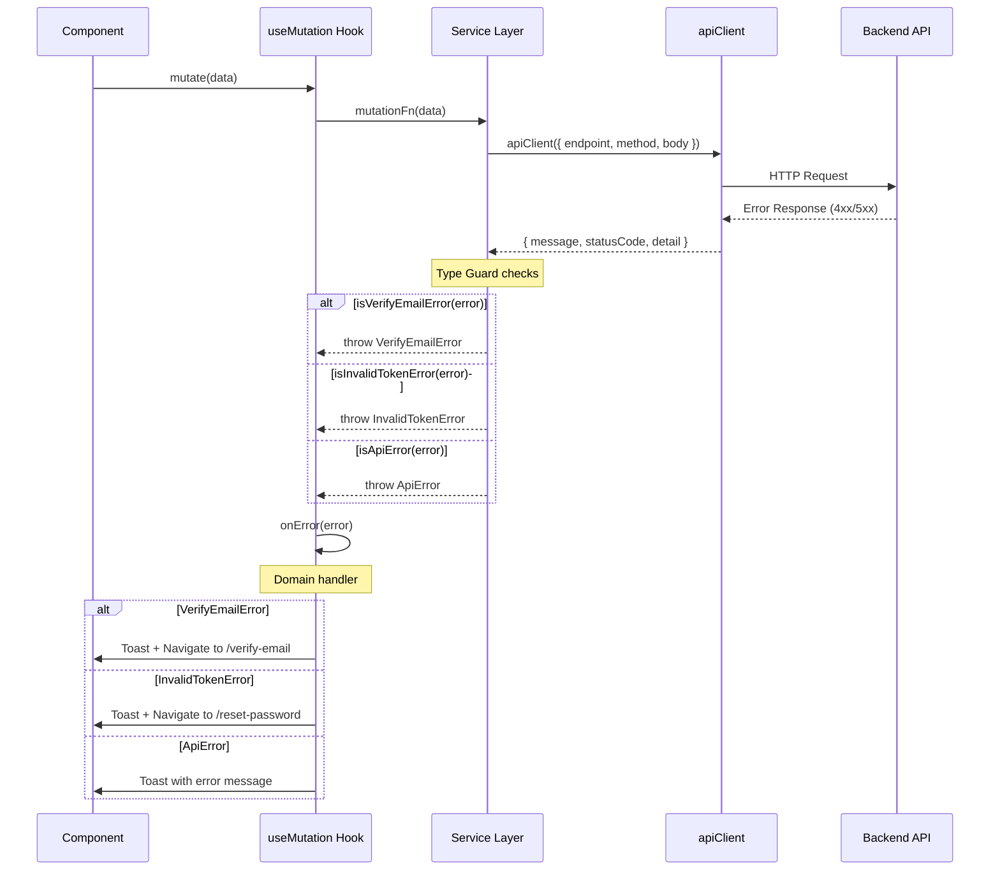
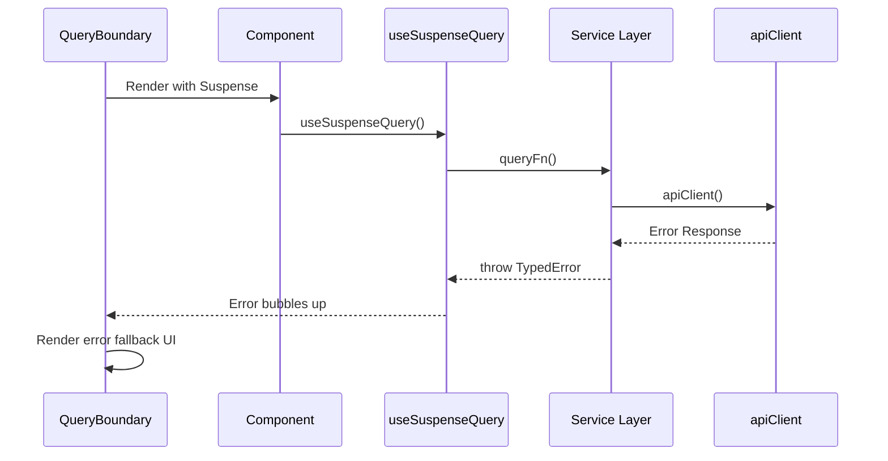

# Frontend Architecture

## Tech Stack

| Layer | Technology |
|-------|------------|
| UI | React 19 + TypeScript |
| Compiler | React Compiler + Babel |
| Build | Vite |
| Routing | TanStack Router (file-based) |
| Server State | TanStack Query |
| Forms | TanStack Form + Zod |
| Tables | TanStack Table |
| Validation | Zod |

## Patterns

### TanStack Query - queryOptions Pattern

Define query configurations as reusable objects:

```typescript
// src/api/users.ts
import { queryOptions } from '@tanstack/react-query'

export const usersQueryOptions = queryOptions({
  queryKey: ['users'],
  queryFn: fetchUsers,
})

export const userQueryOptions = (id: string) =>
  queryOptions({
    queryKey: ['users', id],
    queryFn: () => fetchUser(id),
  })
```

Use in components:

```typescript
const { data } = useQuery(usersQueryOptions)
const { data } = useSuspenseQuery(userQueryOptions(id))
```

### TanStack Router - File-Based Routing

Routes are defined by file structure in `src/routes/`:

```
src/routes/
├── __root.tsx        # Root layout
├── index.tsx         # /
├── about.tsx         # /about
└── users/
    ├── index.tsx     # /users
    └── $userId.tsx   # /users/:userId
```

### TanStack Form - Zod Validation

Use Zod schemas for form validation:

```typescript
import { useForm } from '@tanstack/react-form'
import { zodValidator } from '@tanstack/zod-form-adapter'
import { z } from 'zod'

const schema = z.object({
  email: z.string().email(),
  name: z.string().min(2),
})

const form = useForm({
  defaultValues: { email: '', name: '' },
  validatorAdapter: zodValidator(),
  validators: {
    onChange: schema,
  },
})
```

### Zod - Runtime Validation

Use Zod for API response validation and type inference:

```typescript
const UserSchema = z.object({
  id: z.string(),
  email: z.string().email(),
  name: z.string(),
})

type User = z.infer<typeof UserSchema>

const parseUser = (data: unknown) => UserSchema.parse(data)
```


## Folder Structure

```
src/
├── routes/                    # TanStack Router file-based routes
│   ├── __root.tsx
│   ├── index.tsx
│   └── [feature]/
│
├── features/                  # Feature modules (domain logic)
│   └── [feature]/
│       ├── api/               # queryOptions, mutations
│       ├── components/        # Feature-specific components
│       ├── hooks/             # Feature-specific hooks
│       ├── services/          # API calls, business logic
│       └── types/
│           ├── payloads.ts    # Request body types
│           └── responses.ts   # API response types
│
├── pages/                     # Presentational page components
│   └── [feature]/             # Composes feature components into pages
│       └── UserListPage.tsx
│
├── layouts/                   # Shared layout components
│   ├── Header.tsx
│   ├── Footer.tsx
│   ├── Sidebar.tsx
│   └── DrawerNav.tsx
│
├── hooks/                     # Shared hooks
│   ├── useMediaQuery.ts
│   └── useDebounce.ts
│
├── components/                # Shared UI components
│   ├── ui/                    # Primitives (Button, Input, etc.)
│   └── QueryBoundary.tsx
│
├── lib/                       # Utilities and configuration
│   ├── api-client.ts          # HTTP client
│   └── query-client.ts        # TanStack Query config
│
├── errors/                    # Error handling infrastructure
│   ├── types.ts               # Typed error classes
│   └── guards.ts              # Type guard functions
│
└── shared/
    └── types/
        ├── api/               # Shared API types (User, etc.)
        └── common/            # Utility types
```

### Layer Responsibilities

| Layer | Purpose | Contains |
|-------|---------|----------|
| `routes/` | URL mapping | Route definitions only, delegates to pages |
| `pages/` | Composition | Assembles feature components, purely presentational |
| `features/` | Domain logic | API calls, state, feature-specific components |
| `layouts/` | App shell | Headers, footers, drawers, navigation |
| `hooks/` | Shared behavior | Cross-feature reusable hooks |
| `components/` | Shared UI | Design system primitives |

---

## Error Handling Architecture

This section documents the three-layer error handling strategy used throughout the frontend.

### Architecture Overview

```
┌─────────────────────────────────────────────────────────────────────────┐
│                            API LAYER                                    │
│  apiClient<T>()                                                         │
│  • Executes raw HTTP requests                                           │
│  • Auto-refresh on 401 with token renewal                               │
│  • Returns { message, statusCode, detail } on error                     │
│  • Handles CSRF, credentials, snake→camelCase                           │
└──────────────────────────────────┬──────────────────────────────────────┘
                                   │ catches
                                   ▼
┌─────────────────────────────────────────────────────────────────────────┐
│                         CONSUMPTION LAYER                               │
│  ┌─────────────────────────────┐    ┌─────────────────────────────────┐ │
│  │  MUTATIONS (Writes)         │    │  QUERIES (Reads)                │ │
│  │  • Imperative callbacks     │    │  • Declarative boundaries       │ │
│  │  • onError → handlers       │    │  • useSuspenseQuery             │ │
│  │  • Toast/Navigate actions   │    │  • <QueryBoundary> fallback UI  │ │
│  └──────────────┬──────────────┘    └───────────────┬─────────────────┘ │
└─────────────────┼───────────────────────────────────┼───────────────────┘
                  │ catches                           │ bubbles to
                  ▼                                   ▼
┌─────────────────────────────────────────────────────────────────────────┐
│                          SERVICE LAYER                                  │
│  • Receives raw errors from apiClient                                   │
│  • Uses Type Guards to identify failure modes                           │
│  • Throws Typed Errors (never returns raw HTTP errors)                  │
│                                                                         │
│  Type Guards:           Typed Errors:                                   │
│  isVerifyEmailError()   → VerifyEmailError                              │
│  isInvalidTokenError()  → InvalidTokenError                             │
│  isApiError()           → ApiError (fallback)                           │
└────────────────────────────────────────────────────────────────────────┘

```

### Error Flow Diagrams

#### Mutation Error Flow (Writes)



#### Query Error Flow (Reads)



### Error Handling Philosophy

| Operation | Mental Model | Mechanism | UI Response |
|-----------|--------------|-----------|-------------|
| **Reads (Queries)** | Declarative state | Suspense + Boundaries | Error fallback component |
| **Writes (Mutations)** | Imperative events | Callbacks + handlers | Toast notifications |

**Key Principles:**
1. **Services always throw Typed Errors** — Never return raw HTTP errors
2. **Mutations handle errors imperatively** — Use `onError` callbacks with domain handlers
3. **Queries handle errors declaratively** — Let errors bubble to `<QueryBoundary>`
4. **Global defaults for systemic errors only** — Network failures, 5xx (not domain validation)
5. **401 handled at API layer** — Auto-refresh attempts token renewal; redirects to login on failure

### Error Class Hierarchy

```typescript
// src/errors/types.ts
export class AppError extends Error {
  constructor(
    message: string,
    public readonly code: string,
    public readonly statusCode?: number
  ) {
    super(message)
    this.name = this.constructor.name
  }
}

export class ApiError extends AppError {
  constructor(message: string, statusCode: number, public readonly detail?: unknown) {
    super(message, 'API_ERROR', statusCode)
  }
}

export class VerifyEmailError extends AppError {
  constructor() {
    super('Email verification required', 'VERIFY_EMAIL', 403)
  }
}

export class InvalidTokenError extends AppError {
  constructor() {
    super('Token is invalid or expired', 'INVALID_TOKEN', 400)
  }
}
```

### Type Guards

```typescript
// src/errors/guards.ts
import type { ApiErrorResponse } from '@/lib/api-client'

export const isVerifyEmailError = (error: ApiErrorResponse): boolean =>
  error.statusCode === 403 && error.detail === 'EMAIL_NOT_VERIFIED'

export const isInvalidTokenError = (error: ApiErrorResponse): boolean =>
  error.statusCode === 400 && error.detail === 'INVALID_TOKEN'

export const isApiError = (error: unknown): error is ApiErrorResponse =>
  typeof error === 'object' && error !== null && 'statusCode' in error
```
